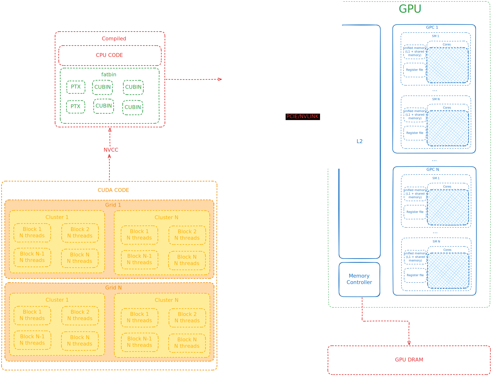

# Learning cuda

This repo contains notes and code that I've done for learning cuda.

The main resources I've used are:

- [https://docs.nvidia.com/cuda/cuda-programming-guide/](https://docs.nvidia.com/cuda/cuda-programming-guide/)
- [https://docs.nvidia.com/cuda/cuda-driver-api/index.html](https://docs.nvidia.com/cuda/cuda-driver-api/index.html)
- [https://docs.nvidia.com/cuda/cuda-runtime-api/index.html](https://docs.nvidia.com/cuda/cuda-runtime-api/index.html)
- [https://docs.nvidia.com/cuda/parallel-thread-execution/index.html](https://docs.nvidia.com/cuda/parallel-thread-execution/index.html)

## Summary

- [notes](#NOTES)
    - [CUDA DEV REFERENCE](#CUDA-DEV-REFERENCE)
        - [Introduction](#Introduction)

## NOTES

### CUDA DEV REFERENCE

From: [https://docs.nvidia.com/cuda/cuda-programming-guide](https://docs.nvidia.com/cuda/cuda-programming-guide)

#### Introduction

- GPUS are dedicated more to `data processing units`, while CPUS are more dedicated for `flow control` and `caching`.
- Host and Devie code can execute simultaneously.
- GPU can be considered a collection of multiple streaming multiprocessors (SMs), which are organized in groups called Graphics Processing Clusters (GPCs).
- Each SM contains -> local register file, unified data cache (shared memory and L1), some functional units for execution
- When a Kernel is launched, many threads are launched as well.
- Threads are organized into blocks.
- Blocks are organized into grids.
- All blocks in a grid are the same size.
- Blocks and grids can be 1,2 or 3 dimensional.
- All threads of a block are executed in a single SM. Allowing efficient syncronization between them.
- Threads in a block have access to shared memory.
- A single SM can have more than one active block.
- The blocks are scheduled to run, so you can defined millions but only thousands are being run.
- A thread cannot rely on the output of another thread, since the scheduler is unpredictable.
- Boards with compute capability >= 9.0, can group blocks in clusters, which can also be 1,2 or 3 dimensional.
- Clusters don't change the indexes of threads, but it allows you to do syncronization and communication at cluster level.
- All blocks in a cluster are executed in the same GPC.
- Clusters can access shared memory of all blocks inside it (distributed shared memory).
- The maximum size of a cluster is hardware dependent.
- In a thread block, threads are organized in groups of 32 called warps.
- Warps follow the SIMT paradigm. Each thread can follow different paths in the code.
- Threads executed by a warp are assigned to a warp lane (numbered from 0 to 31).
- Threads in a warp execute the same instruction.
- If some threads in a warp take a different flow (an if statement for example), the other's will wait for the next instruction. It's called warp divergence.
- In SIMT threads progress in warp in lock steps.
- You may not try to optimize it yourself, since the GPU may try to optimize it at a low level.
- But to optimize it, you may use block sizes that are multiples of 32, due to the warp lanes sizes, avoiding letting the last lane with unused parts.

---

- DRAM from GPU is called global memory.
- CPU DRAM is called host memory or system memory.
- The virtual memory address space from GPU is distinct from CPU.
- It's possible to distinguish between CPU and GPU addresses.
- Each SM has it's own memory that's only accessible within its context.
- The register file, shared memory and L1 cache is accessible throughout the SM.
- To schedule a thread block to an SM, $number\_of\_registers\_per\_thread \times total\_threads\_per\_block \leq available\_registers\_in\_the\_sm$, otherwise you need to decrease the number of threads.
- Shared memory allocations are common for the entire block.
- L2 cache is shared by all SMs.
- SMs also have a constant cache for caching global memory data that was declared `as constant for the lifetime of a kernel`.
- Using the constant cache can improve performance, allowing the kernel parameters being cached in the SM separated from the L1.
- Unified memory -> memory allocations that can be accessed for either CPU or GPU.
- For performance, minimum memory migration and accessing data directly from the processor it resides.

---

- In some situations -> a thread block is suspended and its state is stored in memory (like a context switch), turning the SM free to execute other blocks. This is not common
- Mapped memory -> a way to access address spaces from CPU via GPU, occours via PCIe or NVLINK. It's not more performant than unified memory or any other way.

---

- Compute capability denotes which features are supported by some GPU.
- The version is described as X.Y (major.minor).
- The number itself (like 12.0 -> 120) denotes the SM version (in this case 12.0 -> sm_120).

---

- Cuda runtime is one of the libraries provided by cuda toolkit.
- Cuda runtime API is built on top of Cuda Driver API (a lower-level API).

---

- PTX is a high level assembly language.
- Compilers create it as IR.
- This is IR is dynamically compiled to binary using JIT.
- Its version also follows the compute capability (compute_120 for compute capability 12.0).

---

- The compiled code is transformed into PTX and then into cubin (binary for cuda), that's specific for each hardware version (compute capability).
- The code for GPU is stored in a `fatbin` location.
- Fatbins can contain cubins and PTX for different future targets (compute capabilities).
- A GPU can execute cubins with compute capabilities with the same major and >= the minor.
- The binary also have a version, like sm_86, so it was built for compute capability 8.6.
- PTX can be got from the fatbin and executed for compute capabilities >= to the same of it was especified for it.
- The driver has the JIT compiler.
- nvrtc can compile C++ code into PTX at runtime.

